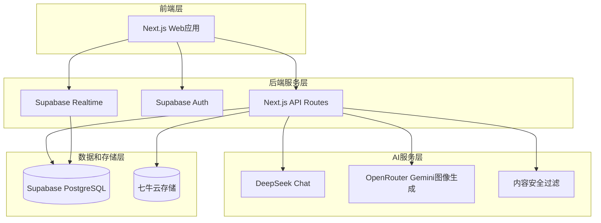

# AI美女伴侣平台设计文档

## 概述

AI美女伴侣平台是一个集成了AI图像生成、智能对话、情感互动的综合性平台。系统采用微服务架构，支持高并发的实时对话，提供个性化的AI伴侣体验。平台通过订阅模式实现商业化，同时确保内容安全和用户隐私保护。

## 架构设计

### 系统架构图



### 技术栈选择

**前端技术栈：**
- Next.js 14 (React 18) - 全栈框架，API Routes
- TypeScript - 类型安全
- Tailwind CSS - 样式框架
- Zustand - 状态管理
- Supabase Client - 数据库和实时通信

**后端技术栈：**
- Next.js API Routes - 服务端API
- Supabase - 数据库、认证、实时通信
- TypeScript - 类型安全

**存储服务：**
- Supabase PostgreSQL - 主数据库
- 七牛云 - 图片和媒体文件存储

**AI服务：**
- DeepSeek Chat - 对话生成和提示词优化
- OpenRouter Google/Gemini - 图像生成
- 自建内容过滤 - 安全审核

### 环境变量配置

基于现有的`.env.local`配置，系统需要以下环境变量：

```bash
# AI服务配置
OPENROUTER_API_KEY=sk-or-v1-xxx
OPENROUTER_IMAGE_MODEL=google/gemini-2.5-flash-image-preview
OPENROUTER_SITE_URL=http://localhost:3000
OPENROUTER_SITE_TITLE=AI Beauty Companion Platform

DEEPSEEK_BASE_URL=https://api.deepseek.com
DEEPSEEK_TEXT_MODEL=deepseek-chat
DEEPSEEK_API_KEY=sk-xxx

# Supabase配置
NEXT_PUBLIC_SUPABASE_URL=https://xxx.supabase.co
NEXT_PUBLIC_SUPABASE_ANON_KEY=eyJxxx
SUPABASE_SERVICE_ROLE_KEY=eyJxxx

# 七牛云存储配置
QINIU_S3_ACCESS_KEY=xxx
QINIU_S3_SECRET_KEY=xxx
QINIU_S3_ENDPOINT=https://s3.ap-southeast-1.qiniucs.com
QINIU_S3_BUCKET=aigirl666
QINIU_PUBLIC_BASE_URL=https://aigirl666.s3.ap-southeast-1.qiniucs.com
QINIU_BUCKET_PRIVATE=true
QINIU_SIGNED_URL_TTL_SECONDS=3600
QINIU_DOWNLOAD_BASE_URL=http://xxx.gdipper.com
```

## 组件和接口设计

### 核心组件

#### 1. 伴侣管理模块 (Companion Management)

```typescript
// Next.js API Routes
// /api/companions/create.ts
export default async function handler(req: NextApiRequest, res: NextApiResponse) {
  const { data, error } = await supabase
    .from('companions')
    .insert(companionData)
    .select()
  
  if (error) throw error
  
  // 生成伴侣头像
  const avatarUrl = await generateCompanionAvatar(companionData.appearance)
  
  return res.json({ companion: data[0], avatarUrl })
}

interface CompanionConfig {
  name: string
  appearance: AppearanceConfig
  personality: PersonalityConfig
  background: string
  isPublic: boolean
}

interface AppearanceConfig {
  faceType: string
  hairStyle: string
  hairColor: string
  bodyType: string
  clothingStyle: string
  customPrompt?: string
}

interface PersonalityConfig {
  type: 'gentle' | 'lively' | 'intellectual' | 'mysterious' | 'cute' | 'mature'
  traits: string[]
  speakingStyle: string
  interests: string[]
}
```

#### 2. 对话系统 (Chat System)

```typescript
// /api/chat/send.ts
export default async function handler(req: NextApiRequest, res: NextApiResponse) {
  const { companionId, message } = req.body
  
  // 检查用户消息配额
  const canSend = await checkMessageQuota(userId)
  if (!canSend) {
    return res.status(429).json({ error: 'Message limit reached' })
  }
  
  // 内容安全检查
  const isSafe = await moderateContent(message)
  if (!isSafe) {
    return res.status(400).json({ error: 'Content not allowed' })
  }
  
  // 获取伴侣信息和对话历史
  const companion = await getCompanion(companionId)
  const chatHistory = await getChatHistory(userId, companionId)
  
  // 使用DeepSeek生成AI回复
  const aiResponse = await generateDeepSeekResponse({
    companion,
    message,
    history: chatHistory
  })
  
  // 保存对话记录到Supabase
  await saveChatMessage(userId, companionId, message, aiResponse)
  
  // 更新亲密度
  const intimacyLevel = await updateIntimacyLevel(userId, companionId)
  
  return res.json({ 
    response: aiResponse, 
    intimacyLevel 
  })
}

// DeepSeek对话生成
async function generateDeepSeekResponse({ companion, message, history }) {
  const systemPrompt = buildCompanionSystemPrompt(companion)
  const conversationHistory = formatChatHistory(history)
  
  const response = await fetch(`${process.env.DEEPSEEK_BASE_URL}/chat/completions`, {
    method: 'POST',
    headers: {
      'Authorization': `Bearer ${process.env.DEEPSEEK_API_KEY}`,
      'Content-Type': 'application/json'
    },
    body: JSON.stringify({
      model: process.env.DEEPSEEK_TEXT_MODEL,
      messages: [
        { role: 'system', content: systemPrompt },
        ...conversationHistory,
        { role: 'user', content: message }
      ],
      temperature: 0.8,
      max_tokens: 500
    })
  })
  
  const data = await response.json()
  return data.choices[0].message.content
}

interface ChatMessage {
  id: string
  user_id: string
  companion_id: string
  sender_type: 'user' | 'companion'
  content: string
  message_type: 'text' | 'voice' | 'image'
  created_at: string
  metadata?: any
}
```

#### 3. 图像生成模块 (Image Generation)

```typescript
// /api/images/generate.ts
export default async function handler(req: NextApiRequest, res: NextApiResponse) {
  const { prompt, style, companionId } = req.body
  
  // 构建完整提示词
  const fullPrompt = buildImagePrompt(prompt, style)
  
  // 使用OpenRouter Gemini生成图像
  const imageData = await generateGeminiImage(fullPrompt)
  
  // 上传到七牛云
  const qiniuUrl = await uploadToQiniu(imageData, 'companions')
  
  return res.json({ imageUrl: qiniuUrl })
}

// OpenRouter Gemini图像生成
async function generateGeminiImage(prompt: string): Promise<Buffer> {
  const response = await fetch('https://openrouter.ai/api/v1/chat/completions', {
    method: 'POST',
    headers: {
      'Authorization': `Bearer ${process.env.OPENROUTER_API_KEY}`,
      'Content-Type': 'application/json',
      'HTTP-Referer': process.env.OPENROUTER_SITE_URL,
      'X-Title': process.env.OPENROUTER_SITE_TITLE
    },
    body: JSON.stringify({
      model: process.env.OPENROUTER_IMAGE_MODEL, // google/gemini-2.5-flash-image-preview
      messages: [
        {
          role: 'user',
          content: [
            {
              type: 'text',
              text: `Generate a high-quality image: ${prompt}`
            }
          ]
        }
      ],
      max_tokens: 1000
    })
  })
  
  const data = await response.json()
  
  // 处理Gemini返回的图像数据
  const imageUrl = data.choices[0].message.content
  const imageResponse = await fetch(imageUrl)
  return Buffer.from(await imageResponse.arrayBuffer())
}

// 七牛云上传服务
async function uploadToQiniu(imageBuffer: Buffer, folder: string): Promise<string> {
  const key = `${folder}/${Date.now()}-${Math.random().toString(36)}.png`
  
  // 使用现有的七牛云配置
  const result = await qiniuClient.upload(key, imageBuffer)
  
  // 如果是私有bucket，返回签名URL
  if (process.env.QINIU_BUCKET_PRIVATE === 'true') {
    return await signQiniuGetUrlForKey(key)
  }
  
  return `${process.env.QINIU_PUBLIC_BASE_URL}/${key}`
}
```

#### 4. 用户订阅系统 (Subscription System)

```typescript
// /api/subscription/create.ts
export default async function handler(req: NextApiRequest, res: NextApiResponse) {
  const { plan, paymentMethod } = req.body
  
  // 创建支付订单
  const paymentOrder = await createPaymentOrder({
    userId,
    plan,
    amount: plan === 'monthly' ? 39 : 299,
    paymentMethod
  })
  
  return res.json({ paymentOrder })
}

interface Subscription {
  id: string
  user_id: string
  type: 'free' | 'premium'
  plan?: 'monthly' | 'yearly'
  start_date?: string
  end_date?: string
  daily_message_limit: number
  features: string[]
  created_at: string
}
```

### API接口设计

#### Next.js API Routes

```typescript
// 伴侣管理
POST   /api/companions/create              // 创建伴侣
GET    /api/companions                     // 获取用户伴侣列表
GET    /api/companions/[id]               // 获取特定伴侣
PUT    /api/companions/[id]               // 更新伴侣
DELETE /api/companions/[id]               // 删除伴侣

// 对话管理
POST   /api/chat/send                     // 发送消息
GET    /api/chat/[companionId]            // 获取对话历史
DELETE /api/chat/[companionId]            // 删除对话记录

// 图像生成
POST   /api/images/generate               // 生成伴侣头像
POST   /api/images/share-card             // 生成分享卡片

// 用户管理
GET    /api/user/profile                  // 获取用户信息
PUT    /api/user/profile                  // 更新用户信息
GET    /api/user/subscription             // 获取订阅信息

// 支付相关
POST   /api/payment/create-order          // 创建支付订单
POST   /api/payment/webhook               // 支付回调

// 分享和推荐
POST   /api/share/companion               // 分享伴侣
POST   /api/referral/register             // 推荐注册
GET    /api/referral/stats                // 推荐统计
```

#### Supabase实时通信

```typescript
// 使用Supabase Realtime进行实时对话
const supabase = createClient(url, key)

// 订阅对话更新
const chatSubscription = supabase
  .channel('chat-updates')
  .on('postgres_changes', {
    event: 'INSERT',
    schema: 'public',
    table: 'chat_messages',
    filter: `companion_id=eq.${companionId}`
  }, (payload) => {
    // 处理新消息
    handleNewMessage(payload.new)
  })
  .subscribe()

// 发送消息状态更新
const sendTypingStatus = (isTyping: boolean) => {
  supabase.channel('typing-status').send({
    type: 'broadcast',
    event: 'typing',
    payload: { companionId, isTyping }
  })
}
```

## 数据模型

### 数据库设计

#### Supabase PostgreSQL 数据库

```sql
-- 用户表 (继承现有auth.users)
CREATE TABLE public.profiles (
  id UUID REFERENCES auth.users(id) PRIMARY KEY,
  username VARCHAR(50) UNIQUE NOT NULL,
  avatar_url TEXT,
  language VARCHAR(2) DEFAULT 'zh',
  referral_code VARCHAR(20) UNIQUE NOT NULL,
  referred_by UUID REFERENCES auth.users(id),
  created_at TIMESTAMP DEFAULT NOW(),
  updated_at TIMESTAMP DEFAULT NOW()
);

-- 订阅表
CREATE TABLE public.subscriptions (
  id UUID PRIMARY KEY DEFAULT gen_random_uuid(),
  user_id UUID REFERENCES auth.users(id) ON DELETE CASCADE,
  type VARCHAR(20) NOT NULL DEFAULT 'free',
  plan VARCHAR(20),
  start_date TIMESTAMP,
  end_date TIMESTAMP,
  daily_message_limit INTEGER DEFAULT 20,
  features JSONB DEFAULT '[]',
  created_at TIMESTAMP DEFAULT NOW(),
  updated_at TIMESTAMP DEFAULT NOW()
);

-- 伴侣表
CREATE TABLE public.companions (
  id UUID PRIMARY KEY DEFAULT gen_random_uuid(),
  user_id UUID REFERENCES auth.users(id) ON DELETE CASCADE,
  name VARCHAR(100) NOT NULL,
  appearance_config JSONB NOT NULL,
  personality_config JSONB NOT NULL,
  background TEXT,
  avatar_url TEXT,
  is_public BOOLEAN DEFAULT FALSE,
  intimacy_level INTEGER DEFAULT 1,
  intimacy_points INTEGER DEFAULT 0,
  created_at TIMESTAMP DEFAULT NOW(),
  updated_at TIMESTAMP DEFAULT NOW()
);

-- 对话记录表
CREATE TABLE public.chat_messages (
  id UUID PRIMARY KEY DEFAULT gen_random_uuid(),
  user_id UUID REFERENCES auth.users(id) ON DELETE CASCADE,
  companion_id UUID REFERENCES public.companions(id) ON DELETE CASCADE,
  sender_type VARCHAR(20) NOT NULL, -- 'user' or 'companion'
  content TEXT NOT NULL,
  message_type VARCHAR(20) DEFAULT 'text', -- 'text', 'voice', 'image'
  metadata JSONB,
  created_at TIMESTAMP DEFAULT NOW()
);

-- 用户消息配额表
CREATE TABLE public.daily_message_quotas (
  id UUID PRIMARY KEY DEFAULT gen_random_uuid(),
  user_id UUID REFERENCES auth.users(id) ON DELETE CASCADE,
  date DATE NOT NULL,
  message_count INTEGER DEFAULT 0,
  last_reset_at TIMESTAMP DEFAULT NOW(),
  UNIQUE(user_id, date)
);

-- 推荐记录表
CREATE TABLE public.referrals (
  id UUID PRIMARY KEY DEFAULT gen_random_uuid(),
  referrer_id UUID REFERENCES auth.users(id),
  referred_id UUID REFERENCES auth.users(id),
  reward_type VARCHAR(50),
  reward_value INTEGER,
  is_claimed BOOLEAN DEFAULT FALSE,
  created_at TIMESTAMP DEFAULT NOW()
);

-- 支付订单表
CREATE TABLE public.payment_orders (
  id UUID PRIMARY KEY DEFAULT gen_random_uuid(),
  user_id UUID REFERENCES auth.users(id) ON DELETE CASCADE,
  plan VARCHAR(20) NOT NULL,
  amount DECIMAL(10,2) NOT NULL,
  currency VARCHAR(3) DEFAULT 'CNY',
  payment_method VARCHAR(50),
  status VARCHAR(20) DEFAULT 'pending', -- 'pending', 'paid', 'failed', 'cancelled'
  external_order_id VARCHAR(255),
  paid_at TIMESTAMP,
  created_at TIMESTAMP DEFAULT NOW()
);

-- 启用行级安全策略
ALTER TABLE public.profiles ENABLE ROW LEVEL SECURITY;
ALTER TABLE public.subscriptions ENABLE ROW LEVEL SECURITY;
ALTER TABLE public.companions ENABLE ROW LEVEL SECURITY;
ALTER TABLE public.chat_messages ENABLE ROW LEVEL SECURITY;
ALTER TABLE public.daily_message_quotas ENABLE ROW LEVEL SECURITY;
ALTER TABLE public.referrals ENABLE ROW LEVEL SECURITY;
ALTER TABLE public.payment_orders ENABLE ROW LEVEL SECURITY;

-- 创建安全策略
CREATE POLICY "Users can view own profile" ON public.profiles
  FOR SELECT USING (auth.uid() = id);

CREATE POLICY "Users can update own profile" ON public.profiles
  FOR UPDATE USING (auth.uid() = id);

CREATE POLICY "Users can view own companions" ON public.companions
  FOR SELECT USING (auth.uid() = user_id OR is_public = true);

CREATE POLICY "Users can manage own companions" ON public.companions
  FOR ALL USING (auth.uid() = user_id);

CREATE POLICY "Users can view own chat messages" ON public.chat_messages
  FOR SELECT USING (auth.uid() = user_id);

CREATE POLICY "Users can create own chat messages" ON public.chat_messages
  FOR INSERT WITH CHECK (auth.uid() = user_id);
```
  user_id UUID REFERENCES auth.users(id) ON DELETE CASCADE,
  companion_id UUID REFERENCES public.companions(id) ON DELETE CASCADE,
  level INTEGER NOT NULL,
  points INTEGER NOT NULL,
  created_at TIMESTAMP DEFAULT NOW()
);

-- 行级安全策略 (RLS)
ALTER TABLE public.profiles ENABLE ROW LEVEL SECURITY;
ALTER TABLE public.subscriptions ENABLE ROW LEVEL SECURITY;
ALTER TABLE public.companions ENABLE ROW LEVEL SECURITY;
ALTER TABLE public.chat_messages ENABLE ROW LEVEL SECURITY;
ALTER TABLE public.daily_message_quotas ENABLE ROW LEVEL SECURITY;
ALTER TABLE public.intimacy_history ENABLE ROW LEVEL SECURITY;

-- 用户只能访问自己的数据
CREATE POLICY "Users can view own profile" ON public.profiles
  FOR SELECT USING (auth.uid() = id);

CREATE POLICY "Users can update own profile" ON public.profiles
  FOR UPDATE USING (auth.uid() = id);

CREATE POLICY "Users can view own companions" ON public.companions
  FOR ALL USING (auth.uid() = user_id);

CREATE POLICY "Users can view own messages" ON public.chat_messages
  FOR ALL USING (auth.uid() = user_id);

-- 公开伴侣可被所有人查看
CREATE POLICY "Public companions viewable by all" ON public.companions
  FOR SELECT USING (is_public = true);
```

## 正确性属性

*属性是一个特征或行为，应该在系统的所有有效执行中保持为真——本质上是关于系统应该做什么的正式声明。属性作为人类可读规范和机器可验证正确性保证之间的桥梁。*

基于需求分析的预工作，以下是系统的核心正确性属性：

### 属性 1: 伴侣创建完整性
*对于任何*有效的伴侣配置，创建伴侣应该生成包含所有必需字段（外观、性格、背景）的完整伴侣对象
**验证: 需求 1.3**

### 属性 2: 对话响应时效性
*对于任何*用户消息，AI伴侣应该在3秒内返回符合其性格设定的回复
**验证: 需求 2.1**

### 属性 3: 记忆系统一致性
*对于任何*对话会话，记忆系统应该正确存储和回忆用户的个人信息和互动历史
**验证: 需求 2.2**

### 属性 4: 亲密度递增性
*对于任何*用户与伴侣的互动，亲密度等级应该单调递增，不会倒退
**验证: 需求 2.5**

### 属性 5: 用户配额限制
*对于任何*免费用户，每日对话次数不应超过20条，达到限制时应提示升级
**验证: 需求 3.2**

### 属性 6: 付费权限解锁
*对于任何*付费用户，应该能够访问无限对话、语音消息和专属内容功能
**验证: 需求 3.5**

### 属性 7: 推荐奖励发放
*对于任何*通过推荐链接注册的新用户，推荐人应该获得7天免费Premium体验
**验证: 需求 5.2**

### 属性 8: 内容安全过滤
*对于任何*用户输入或AI回复，系统应该检测并过滤不当内容，确保符合平台规范
**验证: 需求 6.1, 6.2**

### 属性 9: 数据加密存储
*对于任何*用户对话记录，系统应该使用加密方式存储，保护用户隐私
**验证: 需求 6.3**

### 属性 10: 语言切换一致性
*对于任何*语言切换操作，AI伴侣应该使用对应语言进行后续对话，保持语言一致性
**验证: 需求 7.2**

## 错误处理

### 错误分类和处理策略

#### 1. 用户输入错误
- **无效伴侣配置**: 返回详细的验证错误信息
- **超出消息限制**: 友好提示升级Premium
- **违规内容**: 明确说明违规原因并建议修改

#### 2. 系统错误
- **AI服务超时**: 自动重试3次，失败后返回预设回复
- **数据库连接失败**: 使用缓存数据，后台自动恢复
- **图像生成失败**: 提供默认头像，记录错误日志

#### 3. 第三方服务错误
- **支付服务异常**: 保存订单状态，支持手动重试
- **AI模型不可用**: 自动切换备用模型
- **存储服务故障**: 使用CDN备份，确保服务可用

### 错误监控和恢复

```typescript
interface ErrorHandler {
  handleAIServiceError(error: AIServiceError): Promise<ChatResponse>
  handlePaymentError(error: PaymentError): Promise<PaymentResult>
  handleDatabaseError(error: DatabaseError): Promise<void>
}

class ResilientChatService implements ChatService {
  async sendMessage(userId: string, companionId: string, message: Message): Promise<ChatResponse> {
    try {
      return await this.aiService.generateResponse(message)
    } catch (error) {
      if (error instanceof AITimeoutError) {
        // 重试机制
        return await this.retryWithBackoff(() => 
          this.aiService.generateResponse(message)
        )
      } else if (error instanceof AIServiceUnavailableError) {
        // 降级处理
        return this.getFallbackResponse(companionId, message)
      }
      throw error
    }
  }
}
```

## 测试策略

### 双重测试方法

系统采用单元测试和基于属性的测试相结合的方法：

**单元测试**：
- 验证具体示例和边界情况
- 测试集成点和错误条件
- 确保特定功能的正确行为

**基于属性的测试**：
- 验证通用属性在所有输入中的正确性
- 通过随机化实现全面的输入覆盖
- 每个属性测试最少运行100次迭代

### 测试配置

**属性测试库**: fast-check (JavaScript/TypeScript)
**测试标签格式**: **Feature: ai-beauty-platform, Property {number}: {property_text}**

### 关键测试场景

#### 1. 伴侣创建测试
```typescript
// 单元测试示例
describe('Companion Creation', () => {
  it('should create companion with all required fields', async () => {
    const config = createValidCompanionConfig()
    const companion = await companionService.createCompanion('user-1', config)
    
    expect(companion.name).toBeDefined()
    expect(companion.appearance).toBeDefined()
    expect(companion.personality).toBeDefined()
  })
})

// 属性测试示例
describe('Property Tests', () => {
  it('Property 1: Companion creation completeness', async () => {
    // Feature: ai-beauty-platform, Property 1: 伴侣创建完整性
    await fc.assert(fc.asyncProperty(
      fc.record({
        name: fc.string({ minLength: 1, maxLength: 100 }),
        appearance: validAppearanceConfig(),
        personality: validPersonalityConfig()
      }),
      async (config) => {
        const companion = await companionService.createCompanion('test-user', config)
        expect(companion.name).toBe(config.name)
        expect(companion.appearance).toEqual(config.appearance)
        expect(companion.personality).toEqual(config.personality)
      }
    ))
  })
})
```

#### 2. 对话系统测试
```typescript
describe('Chat System Properties', () => {
  it('Property 2: Response time constraint', async () => {
    // Feature: ai-beauty-platform, Property 2: 对话响应时效性
    await fc.assert(fc.asyncProperty(
      fc.string({ minLength: 1, maxLength: 500 }),
      async (message) => {
        const startTime = Date.now()
        const response = await chatService.sendMessage('user-1', 'companion-1', {
          content: message,
          type: 'text'
        })
        const responseTime = Date.now() - startTime
        
        expect(responseTime).toBeLessThan(3000)
        expect(response.message.content).toBeDefined()
      }
    ))
  })
})
```

#### 3. 用户配额测试
```typescript
describe('User Quota System', () => {
  it('Property 5: Free user message limit', async () => {
    // Feature: ai-beauty-platform, Property 5: 用户配额限制
    await fc.assert(fc.asyncProperty(
      fc.integer({ min: 1, max: 25 }),
      async (messageCount) => {
        const user = await createFreeUser()
        
        for (let i = 0; i < messageCount; i++) {
          const result = await chatService.sendMessage(user.id, 'companion-1', {
            content: `Message ${i}`,
            type: 'text'
          })
          
          if (i < 20) {
            expect(result.message).toBeDefined()
          } else {
            expect(result.error).toContain('upgrade')
          }
        }
      }
    ))
  })
})
```

### 测试覆盖率目标

- **单元测试覆盖率**: ≥ 85%
- **集成测试覆盖率**: ≥ 70%
- **属性测试**: 每个核心属性100+次迭代
- **端到端测试**: 覆盖主要用户流程

通过这种综合测试策略，确保AI美女伴侣平台的可靠性、性能和用户体验质量。

## 前端页面设计

### 页面架构

#### 页面结构
```
/                     - 首页 (伴侣创建/选择)
/chat/[companionId]   - 对话页面
/companions           - 我的伴侣列表
/gallery              - 伴侣广场 (公开伴侣)
/profile              - 个人中心
/subscription         - 订阅管理
/auth                 - 登录注册
```

#### 响应式设计原则
- **移动优先**: 基于320px-768px设计，向上适配
- **断点设置**: 
  - Mobile: 320px - 768px
  - Tablet: 768px - 1024px  
  - Desktop: 1024px+
- **触摸友好**: 按钮最小44px，间距充足
- **性能优化**: 图片懒加载，组件按需加载

### 核心页面设计

#### 1. 首页 - 伴侣创建/选择

**桌面端布局:**
```
┌─────────────────────────────────────────┐
│ Header: Logo | Language | Login/Profile │
├─────────────────────────────────────────┤
│                                         │
│  Hero Section: "创建你的专属AI美女伴侣"    │
│                                         │
├─────────────────────────────────────────┤
│ Quick Start Cards (3列)                 │
│ ┌─────────┐ ┌─────────┐ ┌─────────┐     │
│ │预设伴侣1 │ │预设伴侣2 │ │自定义创建│     │
│ └─────────┘ └─────────┘ └─────────┘     │
├─────────────────────────────────────────┤
│ Features Section (功能介绍)              │
└─────────────────────────────────────────┘
```

**移动端布局:**
```
┌─────────────────┐
│ Header (简化)    │
├─────────────────┤
│                 │
│ Hero (垂直布局)  │
│                 │
├─────────────────┤
│ Quick Cards     │
│ ┌─────────────┐ │
│ │  预设伴侣1   │ │
│ └─────────────┘ │
│ ┌─────────────┐ │
│ │  预设伴侣2   │ │
│ └─────────────┘ │
│ ┌─────────────┐ │
│ │  自定义创建  │ │
│ └─────────────┘ │
└─────────────────┘
```

**React组件结构:**
```typescript
// pages/index.tsx
export default function HomePage() {
  const { t, locale } = useTranslation()
  const { user } = useAuth()
  
  return (
    <Layout>
      <HeroSection />
      <QuickStartSection />
      <FeaturesSection />
      <CTASection />
    </Layout>
  )
}

// components/HeroSection.tsx
function HeroSection() {
  return (
    <section className="relative min-h-[60vh] flex items-center justify-center bg-gradient-to-br from-pink-500/10 via-purple-500/10 to-blue-500/10">
      <div className="container mx-auto px-4 text-center">
        <h1 className="text-4xl md:text-6xl font-bold mb-6 bg-gradient-to-r from-pink-500 to-purple-600 bg-clip-text text-transparent">
          {t('hero.title')}
        </h1>
        <p className="text-lg md:text-xl text-gray-600 mb-8 max-w-2xl mx-auto">
          {t('hero.subtitle')}
        </p>
        <Button size="lg" className="bg-gradient-to-r from-pink-500 to-purple-600">
          {t('hero.cta')}
        </Button>
      </div>
    </section>
  )
}
```

#### 2. 对话页面 - 核心交互界面

**移动端优先设计:**
```
┌─────────────────┐
│ ┌─┐ 伴侣名称  ⚙️ │ <- Header (44px高)
├─────────────────┤
│                 │
│   对话消息区域    │ <- 主要区域，可滚动
│                 │
│ 👤: 你好         │
│                 │
│     💕: 你好呀～  │
│                 │
├─────────────────┤
│ [输入框] [发送]   │ <- 固定底部 (60px高)
└─────────────────┘
```

**React组件:**
```typescript
// pages/chat/[companionId].tsx
export default function ChatPage() {
  const router = useRouter()
  const { companionId } = router.query
  const { messages, sendMessage, isTyping } = useChat(companionId)
  
  return (
    <div className="flex flex-col h-screen bg-gray-50">
      {/* Header */}
      <ChatHeader companion={companion} />
      
      {/* Messages */}
      <div className="flex-1 overflow-y-auto px-4 py-2">
        <MessageList messages={messages} />
        {isTyping && <TypingIndicator />}
      </div>
      
      {/* Input */}
      <ChatInput onSend={sendMessage} />
    </div>
  )
}

// components/ChatInput.tsx
function ChatInput({ onSend }: { onSend: (message: string) => void }) {
  const [message, setMessage] = useState('')
  
  return (
    <div className="border-t bg-white p-4 safe-area-inset-bottom">
      <div className="flex items-end gap-3">
        <div className="flex-1 relative">
          <textarea
            value={message}
            onChange={(e) => setMessage(e.target.value)}
            placeholder={t('chat.placeholder')}
            className="w-full resize-none rounded-2xl border border-gray-200 px-4 py-3 pr-12 focus:border-pink-500 focus:outline-none"
            rows={1}
            style={{ minHeight: '44px', maxHeight: '120px' }}
          />
        </div>
        <Button
          onClick={() => onSend(message)}
          disabled={!message.trim()}
          className="h-11 w-11 rounded-full bg-pink-500 p-0"
        >
          <SendIcon className="h-5 w-5" />
        </Button>
      </div>
    </div>
  )
}
```

#### 3. 伴侣创建页面

**步骤式创建流程:**
```
Step 1: 选择类型     Step 2: 外观定制     Step 3: 性格设置     Step 4: 完成
┌─────────────┐    ┌─────────────┐    ┌─────────────┐    ┌─────────────┐
│ ○ 邻家女孩   │    │ 发型: [选择] │    │ 性格: 温柔   │    │ 预览伴侣     │
│ ○ 职场精英   │    │ 发色: [选择] │    │ 爱好: [选择] │    │ [开始对话]   │
│ ○ 学生妹妹   │    │ 服装: [选择] │    │ 说话风格:   │    │             │
│ ○ 自定义     │    │ 风格: [选择] │    │ [选择]      │    │             │
└─────────────┘    └─────────────┘    └─────────────┘    └─────────────┘
```

**React组件:**
```typescript
// pages/create-companion.tsx
export default function CreateCompanionPage() {
  const [step, setStep] = useState(1)
  const [config, setConfig] = useState<CompanionConfig>({})
  
  return (
    <Layout>
      <div className="container mx-auto px-4 py-8">
        {/* Progress Bar */}
        <ProgressBar currentStep={step} totalSteps={4} />
        
        {/* Step Content */}
        <div className="mt-8">
          {step === 1 && <TypeSelection config={config} onChange={setConfig} />}
          {step === 2 && <AppearanceCustomization config={config} onChange={setConfig} />}
          {step === 3 && <PersonalitySettings config={config} onChange={setConfig} />}
          {step === 4 && <CompanionPreview config={config} />}
        </div>
        
        {/* Navigation */}
        <div className="flex justify-between mt-8">
          <Button 
            variant="outline" 
            onClick={() => setStep(s => s - 1)}
            disabled={step === 1}
          >
            {t('common.previous')}
          </Button>
          <Button 
            onClick={() => step < 4 ? setStep(s => s + 1) : createCompanion()}
          >
            {step < 4 ? t('common.next') : t('companion.create')}
          </Button>
        </div>
      </div>
    </Layout>
  )
}
```

### 国际化设计

#### 语言切换组件
```typescript
// components/LanguageSwitch.tsx
function LanguageSwitch() {
  const { locale, setLocale } = useTranslation()
  
  return (
    <div className="relative">
      <Button variant="ghost" size="sm" className="gap-2">
        <GlobeIcon className="h-4 w-4" />
        {locale === 'zh' ? '中文' : 'English'}
      </Button>
      <DropdownMenu>
        <DropdownMenuItem onClick={() => setLocale('zh')}>
          🇨🇳 中文
        </DropdownMenuItem>
        <DropdownMenuItem onClick={() => setLocale('en')}>
          🇺🇸 English
        </DropdownMenuItem>
      </DropdownMenu>
    </div>
  )
}
```

#### 翻译文件结构
```typescript
// locales/zh.json
{
  "hero": {
    "title": "创建你的专属AI美女伴侣",
    "subtitle": "与智能、美丽、个性化的AI伴侣开始你的专属对话",
    "cta": "立即开始"
  },
  "companion": {
    "types": {
      "neighbor": "邻家女孩",
      "office": "职场精英", 
      "student": "学生妹妹",
      "custom": "自定义创建"
    }
  },
  "chat": {
    "placeholder": "输入消息...",
    "typing": "正在输入...",
    "send": "发送"
  }
}

// locales/en.json
{
  "hero": {
    "title": "Create Your AI Beauty Companion",
    "subtitle": "Start exclusive conversations with intelligent, beautiful, personalized AI companions",
    "cta": "Get Started"
  },
  "companion": {
    "types": {
      "neighbor": "Girl Next Door",
      "office": "Career Woman",
      "student": "Student Girl", 
      "custom": "Custom Create"
    }
  },
  "chat": {
    "placeholder": "Type a message...",
    "typing": "Typing...",
    "send": "Send"
  }
}
```

### 移动端优化

#### 触摸交互优化
```typescript
// hooks/useTouch.ts
export function useTouch() {
  const [isTouch, setIsTouch] = useState(false)
  
  useEffect(() => {
    setIsTouch('ontouchstart' in window)
  }, [])
  
  return { isTouch }
}

// 在组件中使用
function ChatMessage({ message }: { message: Message }) {
  const { isTouch } = useTouch()
  
  return (
    <div 
      className={`
        p-3 rounded-2xl max-w-[80%] 
        ${isTouch ? 'active:scale-95' : 'hover:shadow-md'}
        transition-all duration-200
      `}
    >
      {message.content}
    </div>
  )
}
```

#### 安全区域适配
```css
/* globals.css */
.safe-area-inset-top {
  padding-top: env(safe-area-inset-top);
}

.safe-area-inset-bottom {
  padding-bottom: env(safe-area-inset-bottom);
}

.safe-area-inset-left {
  padding-left: env(safe-area-inset-left);
}

.safe-area-inset-right {
  padding-right: env(safe-area-inset-right);
}
```

#### PWA支持
```typescript
// next.config.js
const withPWA = require('next-pwa')({
  dest: 'public',
  register: true,
  skipWaiting: true,
})

module.exports = withPWA({
  // Next.js config
})

// public/manifest.json
{
  "name": "AI Beauty Companion",
  "short_name": "AI Companion",
  "description": "Your personal AI beauty companion",
  "start_url": "/",
  "display": "standalone",
  "background_color": "#ffffff",
  "theme_color": "#ec4899",
  "icons": [
    {
      "src": "/icon-192.png",
      "sizes": "192x192",
      "type": "image/png"
    },
    {
      "src": "/icon-512.png", 
      "sizes": "512x512",
      "type": "image/png"
    }
  ]
}
```

### 性能优化

#### 图片优化
```typescript
// components/OptimizedImage.tsx
function OptimizedImage({ src, alt, ...props }: ImageProps) {
  return (
    <Image
      src={src}
      alt={alt}
      loading="lazy"
      placeholder="blur"
      blurDataURL="data:image/jpeg;base64,/9j/4AAQSkZJRgABAQAAAQ..."
      {...props}
    />
  )
}
```

#### 代码分割
```typescript
// 动态导入重型组件
const CompanionCreator = dynamic(() => import('../components/CompanionCreator'), {
  loading: () => <LoadingSpinner />,
  ssr: false
})

const ChatInterface = dynamic(() => import('../components/ChatInterface'), {
  loading: () => <ChatSkeleton />
})
```

这个前端设计方案提供了：

1. **完整的页面架构** - 覆盖所有核心功能页面
2. **响应式设计** - 移动优先，适配所有设备
3. **国际化支持** - 中英文双语切换
4. **移动端优化** - 触摸友好，PWA支持
5. **性能优化** - 懒加载，代码分割
6. **用户体验** - 流畅的交互和视觉设计

整个设计基于现有的技术栈（Next.js + Tailwind CSS），确保与后端API的完美集成。