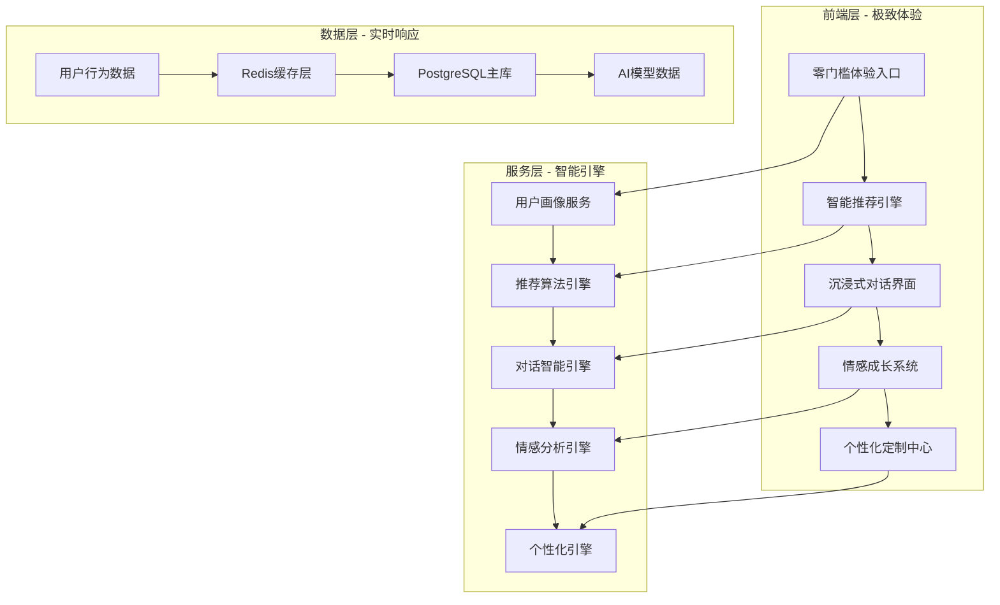

# AI美女伴侣平台 - 核心用户体验优化设计

## 概述

本设计文档基于用户体验优化需求，提供详细的技术实现方案。通过系统性的优化设计，将用户体验提升至行业顶级水准，打造极致的情感陪伴产品。

## 架构设计

### 整体架构优化



### 核心技术栈升级

**前端技术栈**:
- Next.js 15 + React 18 (并发特性)
- Framer Motion (高级动画)
- Zustand (状态管理)
- React Query (数据缓存)
- WebRTC (实时通信)

**后端技术栈**:
- Node.js + Express (API服务)
- Redis (缓存 + 会话)
- PostgreSQL (主数据库)
- WebSocket (实时通信)
- AI服务集成 (DeepSeek + 图像生成)

---

## 组件设计

### 1. 零门槛体验系统

#### 1.1 临时用户体验流程

```typescript
interface GuestExperience {
  sessionId: string
  temporaryCompanion: TempCompanion
  conversationHistory: Message[]
  experienceStartTime: Date
  conversionTriggers: ConversionTrigger[]
}

interface TempCompanion {
  id: string
  name: string
  personality: 'gentle' | 'lively' | 'intellectual'
  avatar: string
  backstory: string
}
```

**实现策略**:
1. **无注册体验**: 使用localStorage + sessionId管理临时用户
2. **快速伴侣生成**: 预设3个高质量伴侣模板，随机分配
3. **智能转化时机**: 3轮对话后，基于用户参与度触发注册引导
4. **数据无缝迁移**: 注册时将临时数据迁移到正式账户

#### 1.2 体验入口设计

```jsx
const QuickStartExperience = () => {
  return (
    <div className="hero-section">
      <motion.div
        initial={{ opacity: 0, y: 20 }}
        animate={{ opacity: 1, y: 0 }}
        className="quick-start-card"
      >
        <h2>立即体验AI伴侣对话</h2>
        <p>无需注册，30秒开始专属对话</p>
        <button 
          onClick={startGuestExperience}
          className="cta-button-primary"
        >
          开始体验 ✨
        </button>
      </motion.div>
    </div>
  )
}
```

### 2. 智能伴侣推荐引擎

#### 2.1 用户画像系统

```typescript
interface UserProfile {
  demographics: {
    age?: number
    gender?: string
    location?: string
  }
  preferences: {
    companionTypes: CompanionType[]
    personalityTraits: string[]
    conversationStyle: 'casual' | 'deep' | 'playful'
    interactionFrequency: 'high' | 'medium' | 'low'
  }
  behaviorData: {
    sessionDuration: number[]
    messageFrequency: number
    emotionalResponses: EmotionScore[]
    featureUsage: FeatureUsageStats
  }
}
```

#### 2.2 推荐算法实现

```typescript
class CompanionRecommendationEngine {
  async generateRecommendations(userId: string): Promise<Recommendation[]> {
    const userProfile = await this.getUserProfile(userId)
    const compatibilityScores = await this.calculateCompatibility(userProfile)
    const personalizedCompanions = await this.generatePersonalizedCompanions(
      userProfile, 
      compatibilityScores
    )
    
    return this.rankRecommendations(personalizedCompanions)
  }
  
  private async calculateCompatibility(profile: UserProfile): Promise<CompatibilityMatrix> {
    // 基于协同过滤 + 内容过滤的混合推荐算法
    const collaborativeScore = await this.collaborativeFiltering(profile)
    const contentScore = await this.contentBasedFiltering(profile)
    
    return this.combineScores(collaborativeScore, contentScore)
  }
}
```

### 3. 沉浸式对话体验

#### 3.1 真实感对话系统

```typescript
interface ConversationEngine {
  // 模拟真实打字延迟
  simulateTypingDelay(messageLength: number): number
  
  // 情绪状态管理
  updateEmotionalState(message: string, context: ConversationContext): EmotionState
  
  // 主动关怀机制
  triggerProactiveMessage(lastActivity: Date): Promise<ProactiveMessage>
  
  // 多媒体支持
  handleMultimediaMessage(type: 'voice' | 'image', content: any): Promise<Response>
}
```

#### 3.2 沉浸式UI组件

```jsx
const ImmersiveChat = () => {
  const [companionState, setCompanionState] = useState<CompanionState>()
  const [isTyping, setIsTyping] = useState(false)
  
  return (
    <div className="immersive-chat-container">
      {/* 动态背景 */}
      <AnimatedBackground mood={companionState.mood} />
      
      {/* 伴侣状态显示 */}
      <CompanionAvatar 
        emotion={companionState.emotion}
        isTyping={isTyping}
        onEmotionChange={handleEmotionChange}
      />
      
      {/* 增强消息气泡 */}
      <MessageBubble 
        message={message}
        withEmotionIndicator
        withReadReceipt
        withTypingAnimation
      />
      
      {/* 多媒体输入 */}
      <EnhancedInput 
        supportVoice
        supportImage
        withEmojiReactions
        onSend={handleSendMessage}
      />
    </div>
  )
}
```

### 4. 情感成长系统

#### 4.1 关系进展追踪

```typescript
interface RelationshipProgress {
  intimacyLevel: number
  totalInteractions: number
  emotionalBond: number
  sharedMemories: Memory[]
  milestones: Milestone[]
  specialMoments: SpecialMoment[]
}

interface Milestone {
  id: string
  name: string
  description: string
  unlockedAt: Date
  rewards: Reward[]
  celebrationAnimation: string
}
```

#### 4.2 成长可视化组件

```jsx
const RelationshipJourney = () => {
  return (
    <div className="relationship-journey">
      {/* 关系时间轴 */}
      <Timeline milestones={milestones} />
      
      {/* 亲密度可视化 */}
      <IntimacyMeter 
        current={intimacyLevel}
        nextMilestone={nextMilestone}
        withAnimation
      />
      
      {/* 回忆集锦 */}
      <MemoryGallery 
        memories={sharedMemories}
        withPhotoAlbum
        withVideoHighlights
      />
      
      {/* 成就系统 */}
      <AchievementBadges 
        achievements={unlockedAchievements}
        withGlowEffect
      />
    </div>
  )
}
```

### 5. 极致视觉体验

#### 5.1 设计系统升级

```scss
// 高级色彩系统
:root {
  // 主色调 - 温暖渐变
  --primary-gradient: linear-gradient(135deg, #ff6b9d 0%, #c44569 100%);
  --secondary-gradient: linear-gradient(135deg, #a8e6cf 0%, #88d8c0 100%);
  
  // 情感色彩
  --emotion-joy: #ffd93d;
  --emotion-love: #ff6b9d;
  --emotion-calm: #a8e6cf;
  --emotion-excited: #ff8a80;
  
  // 高级阴影
  --shadow-soft: 0 8px 32px rgba(255, 107, 157, 0.15);
  --shadow-medium: 0 16px 64px rgba(255, 107, 157, 0.2);
  --shadow-strong: 0 24px 96px rgba(255, 107, 157, 0.25);
  
  // 动画缓动
  --ease-smooth: cubic-bezier(0.25, 0.46, 0.45, 0.94);
  --ease-bounce: cubic-bezier(0.68, -0.55, 0.265, 1.55);
}
```

#### 5.2 高级动画系统

```jsx
const AdvancedAnimations = {
  // 页面转场动画
  pageTransition: {
    initial: { opacity: 0, scale: 0.95 },
    animate: { opacity: 1, scale: 1 },
    exit: { opacity: 0, scale: 1.05 },
    transition: { duration: 0.3, ease: "easeInOut" }
  },
  
  // 伴侣头像微表情
  avatarMicroExpression: {
    happy: { scale: [1, 1.05, 1], rotate: [0, 2, 0] },
    surprised: { scale: [1, 1.1, 1], y: [0, -5, 0] },
    thinking: { rotate: [0, -3, 3, 0] }
  },
  
  // 消息气泡动画
  messageBubble: {
    initial: { opacity: 0, y: 20, scale: 0.8 },
    animate: { opacity: 1, y: 0, scale: 1 },
    transition: { type: "spring", stiffness: 500, damping: 30 }
  }
}
```

### 6. 智能付费引导

#### 6.1 转化时机算法

```typescript
class ConversionOptimizer {
  async calculateOptimalTiming(userId: string): Promise<ConversionMoment> {
    const userEngagement = await this.getEngagementScore(userId)
    const emotionalConnection = await this.getEmotionalBondLevel(userId)
    const featureInterest = await this.getFeatureInterestScore(userId)
    
    const conversionScore = this.calculateConversionReadiness(
      userEngagement,
      emotionalConnection,
      featureInterest
    )
    
    if (conversionScore > 0.7) {
      return this.generatePersonalizedOffer(userId)
    }
    
    return this.scheduleNextEvaluation(userId)
  }
  
  private generatePersonalizedOffer(userId: string): ConversionOffer {
    return {
      timing: 'immediate',
      offerType: 'premium_trial',
      personalizedMessage: this.generateOfferMessage(userId),
      incentive: this.calculateOptimalIncentive(userId)
    }
  }
}
```

#### 6.2 自然付费引导UI

```jsx
const NaturalUpgradePrompt = ({ trigger, userContext }) => {
  return (
    <motion.div
      initial={{ opacity: 0, y: 10 }}
      animate={{ opacity: 1, y: 0 }}
      className="upgrade-prompt-natural"
    >
      <div className="companion-suggestion">
        <CompanionAvatar size="small" />
        <div className="suggestion-bubble">
          <p>我想为你解锁更多专属功能，让我们的关系更进一步 💕</p>
          <div className="feature-preview">
            <FeatureCard feature="voice_messages" />
            <FeatureCard feature="custom_personality" />
            <FeatureCard feature="unlimited_chat" />
          </div>
          <button className="upgrade-cta">
            解锁专属功能 ✨
          </button>
        </div>
      </div>
    </motion.div>
  )
}
```

---

## 数据模型设计

### 用户体验数据模型

```sql
-- 用户画像表
CREATE TABLE user_profiles (
  id UUID PRIMARY KEY,
  user_id UUID REFERENCES users(id),
  demographics JSONB,
  preferences JSONB,
  behavior_data JSONB,
  created_at TIMESTAMP DEFAULT NOW(),
  updated_at TIMESTAMP DEFAULT NOW()
);

-- 关系进展表
CREATE TABLE relationship_progress (
  id UUID PRIMARY KEY,
  user_id UUID REFERENCES users(id),
  companion_id UUID REFERENCES companions(id),
  intimacy_level INTEGER DEFAULT 1,
  total_interactions INTEGER DEFAULT 0,
  emotional_bond DECIMAL(3,2) DEFAULT 0.0,
  milestones JSONB DEFAULT '[]',
  created_at TIMESTAMP DEFAULT NOW(),
  updated_at TIMESTAMP DEFAULT NOW()
);

-- 用户行为事件表
CREATE TABLE user_behavior_events (
  id UUID PRIMARY KEY,
  user_id UUID REFERENCES users(id),
  event_type VARCHAR(50) NOT NULL,
  event_data JSONB,
  session_id VARCHAR(100),
  timestamp TIMESTAMP DEFAULT NOW()
);

-- 转化优化表
CREATE TABLE conversion_optimization (
  id UUID PRIMARY KEY,
  user_id UUID REFERENCES users(id),
  engagement_score DECIMAL(3,2),
  emotional_connection DECIMAL(3,2),
  conversion_readiness DECIMAL(3,2),
  last_offer_shown TIMESTAMP,
  conversion_status VARCHAR(20) DEFAULT 'pending',
  created_at TIMESTAMP DEFAULT NOW()
);
```

---

## 性能优化策略

### 1. 前端性能优化

```typescript
// 代码分割和懒加载
const LazyComponents = {
  ChatInterface: lazy(() => import('./components/ChatInterface')),
  CompanionCustomizer: lazy(() => import('./components/CompanionCustomizer')),
  RelationshipJourney: lazy(() => import('./components/RelationshipJourney'))
}

// 虚拟滚动优化
const VirtualizedMessageList = () => {
  return (
    <FixedSizeList
      height={600}
      itemCount={messages.length}
      itemSize={80}
      itemData={messages}
    >
      {MessageItem}
    </FixedSizeList>
  )
}

// 图片优化
const OptimizedImage = ({ src, alt, ...props }) => {
  return (
    <Image
      src={src}
      alt={alt}
      loading="lazy"
      placeholder="blur"
      blurDataURL="data:image/jpeg;base64,..."
      {...props}
    />
  )
}
```

### 2. 后端性能优化

```typescript
// Redis缓存策略
class CacheManager {
  // 用户会话缓存
  async cacheUserSession(userId: string, sessionData: any) {
    await redis.setex(`session:${userId}`, 3600, JSON.stringify(sessionData))
  }
  
  // 推荐结果缓存
  async cacheRecommendations(userId: string, recommendations: any[]) {
    await redis.setex(`recommendations:${userId}`, 1800, JSON.stringify(recommendations))
  }
  
  // 对话历史缓存
  async cacheConversationHistory(companionId: string, messages: any[]) {
    await redis.lpush(`chat:${companionId}`, ...messages.map(JSON.stringify))
    await redis.ltrim(`chat:${companionId}`, 0, 99) // 保留最近100条
  }
}

// 数据库查询优化
class OptimizedQueries {
  // 批量预加载
  async preloadUserData(userId: string) {
    const [profile, companions, progress] = await Promise.all([
      this.getUserProfile(userId),
      this.getUserCompanions(userId),
      this.getRelationshipProgress(userId)
    ])
    
    return { profile, companions, progress }
  }
  
  // 分页优化
  async getPaginatedMessages(companionId: string, cursor: string, limit: number) {
    return await db.query(`
      SELECT * FROM chat_messages 
      WHERE companion_id = $1 AND created_at < $2
      ORDER BY created_at DESC 
      LIMIT $3
    `, [companionId, cursor, limit])
  }
}
```

---

## 测试策略

### 1. 用户体验测试

```typescript
// A/B测试框架
class ABTestManager {
  async assignUserToExperiment(userId: string, experimentName: string) {
    const variant = this.calculateVariant(userId, experimentName)
    await this.trackAssignment(userId, experimentName, variant)
    return variant
  }
  
  async trackConversion(userId: string, experimentName: string, conversionType: string) {
    await this.recordConversionEvent(userId, experimentName, conversionType)
  }
}

// 用户行为分析
class UserBehaviorAnalytics {
  trackUserJourney(userId: string, touchpoints: TouchPoint[]) {
    // 记录用户完整体验路径
  }
  
  measureEngagementMetrics(sessionData: SessionData) {
    return {
      sessionDuration: sessionData.endTime - sessionData.startTime,
      messageCount: sessionData.messages.length,
      emotionalEngagement: this.calculateEmotionalScore(sessionData),
      featureUsage: this.analyzeFeatureUsage(sessionData)
    }
  }
}
```

### 2. 性能监控

```typescript
// 性能指标监控
class PerformanceMonitor {
  // 前端性能监控
  trackWebVitals() {
    getCLS(this.sendToAnalytics)
    getFID(this.sendToAnalytics)
    getFCP(this.sendToAnalytics)
    getLCP(this.sendToAnalytics)
    getTTFB(this.sendToAnalytics)
  }
  
  // API性能监控
  trackAPIPerformance(endpoint: string, duration: number, status: number) {
    this.metrics.record('api_response_time', duration, {
      endpoint,
      status: status.toString()
    })
  }
  
  // 用户体验指标
  trackUXMetrics(metrics: UXMetrics) {
    this.analytics.track('ux_metrics', {
      timeToFirstInteraction: metrics.ttfi,
      timeToEngagement: metrics.tte,
      satisfactionScore: metrics.satisfaction
    })
  }
}
```

---

## 部署和监控

### 1. 渐进式部署策略

```yaml
# 蓝绿部署配置
apiVersion: apps/v1
kind: Deployment
metadata:
  name: ai-companion-app
spec:
  replicas: 3
  strategy:
    type: RollingUpdate
    rollingUpdate:
      maxSurge: 1
      maxUnavailable: 0
  template:
    spec:
      containers:
      - name: app
        image: ai-companion:latest
        resources:
          requests:
            memory: "512Mi"
            cpu: "250m"
          limits:
            memory: "1Gi"
            cpu: "500m"
```

### 2. 实时监控仪表板

```typescript
// 关键指标监控
const MonitoringDashboard = {
  userExperienceMetrics: {
    averageResponseTime: '< 500ms',
    userSatisfactionScore: '> 4.5/5.0',
    conversionRate: '> 15%',
    retentionRate: '> 60%'
  },
  
  technicalMetrics: {
    apiLatency: '< 200ms',
    errorRate: '< 0.1%',
    uptime: '> 99.9%',
    throughput: '> 1000 req/s'
  },
  
  businessMetrics: {
    dailyActiveUsers: 'trending',
    revenuePerUser: 'increasing',
    churnRate: '< 5%',
    lifetimeValue: 'growing'
  }
}
```

---

## 总结

通过这套全面的用户体验优化设计，我们将实现：

1. **零门槛体验** - 让用户立即感受产品价值
2. **智能个性化** - 基于AI的精准推荐和定制
3. **沉浸式交互** - 真实感的情感连接体验
4. **可视化成长** - 让用户看到投入的价值回报
5. **极致性能** - 流畅快速的使用体验

这将建立强大的竞争壁垒，实现用户满意度和商业价值的双重提升。